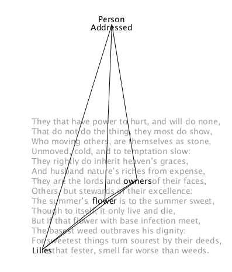
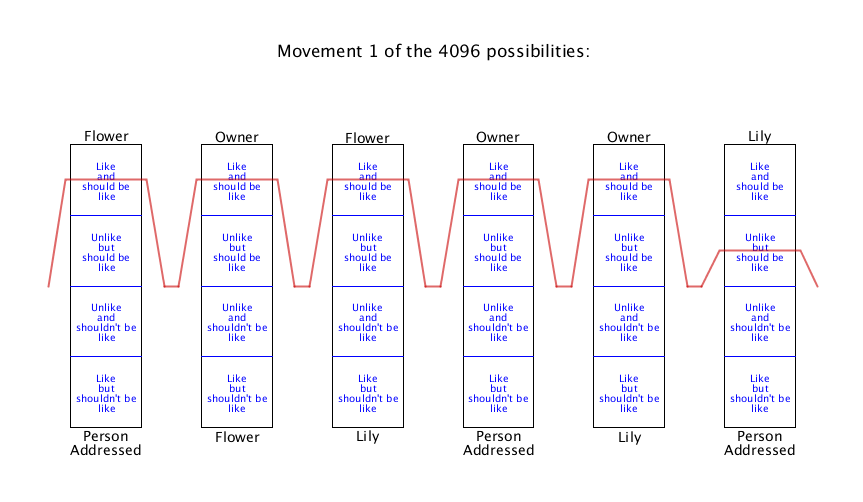
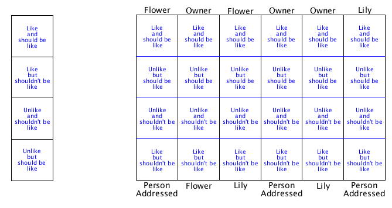
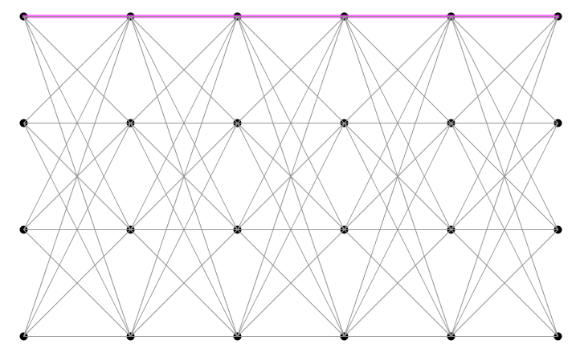

## Synopsis

*at once an indecision and a structure, like the symbol of the Cross* - William Empson

In the 1935 text, Some Versions of Pastoral, the mathematician turned literary critic, William Empson, states that Shakespeare’s Sonnet 94 has 4096 different meanings. 

This program provides a visual explanation of how Empson arrives at this number 4096.

## Motivation

* To provide a visual solution to this literary critical conundrum for my MSc thesis.
* To explore a diagrammatic representation of William Empson's generative scheme

## Screenshots






## William Empson

```
The vague and generalised language of the descriptions, which might be talking 
about so many sorts of people as well as feeling so many things about them,
somehow makes a unity like a cross-roads, which analysis does not deal with by 
exploring down the roads; makes a solid flute on which you can play a multitude 
of tunes, whose solidity no list of all possible tunes would go far to explain.
(Some Versions of Pastoral, p. 90)
```


## Installation

* Download and install Processing from http://www.processing.org.
* Ensure all files are inside a directory called **Sonnet_94_4096_Meanings**

## References

William Empson, *Some Versions of Pastoral*
